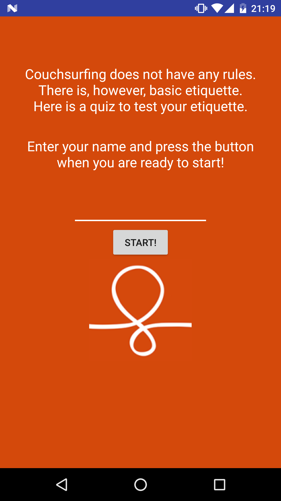

# Android Couchsurfing Quiz

- Project **Quiz App**
- [Android Basics Nanodegree at Udacity.com](https://www.udacity.com/course/android-basics-nanodegree-by-google--nd803).

## Android Items
- Arrays
- Click listeners
- Checkboxes
- Radio Groups
- EditText
- Intents

## Description 
- 5 Question's quiz about Couchsurfing
- Final score is shown after answering 5 questions
- Learn more about[Couchsurfing](www.couchsurfing.com/)

## Screenshots
  
